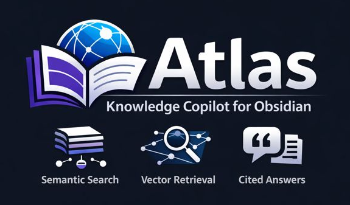

# Atlas

  

  
<em>Atlas is a RAG-based knowledge copilot for Obsidian markdown vaults. It performs semantic chunking, vector search, and grounded LLM responses with citation to original notes.</em>

  

    
    
  

  

    <a href="#introduction">Introduction</a> •
    <a href="#architecture">Architecture</a> •
    <a href="#setup">Setup</a> •
    <a href="#quick-start">Quick Start</a> •
    <a href="#results">Results</a>
  

## Introduction

#### Knowledge Copilot

As a famous LLM once said.
> A knowledge copilot is an AI assistant that understands your knowledge base and helps you query, synthesize, and navigate it—while staying faithful to the original sources.

A good knowledge copilot can search semantically, answer with context, connect ideas, cite sources and assist, not replace thinking. Its basically a "copilot" for our brains.

A good knowledge copilot is built using RAG (Retrieval-Augmented Generation). And what is that?

#### RAG

RAG or Retrieval Augmented Generation is a technique used to retrieve external knowledge (as context) and feed it into the model when prompted with a query. When an LLM is trained on generic data to perform next token prediction, it might be good at that task but would not be able to answer specific questions such as based on our knowledge sources. Hence RAG ensures that we dont just rely on the model's weights but "augment" it using our knowledge base to answer questions related to our knowledge base.

RAG is good because:
- Reduces hallucinations

- Enables citations

- Keeps answers faithful to source material

#### Obsidian

[Obsidian](https://obsidian.md/) is a light weight application used to take notes and create knowledge bases. It saves all the notes as markdown making it easy to load, process and render a huge amount of notes.

- **Obsidian Frontmatter**
  - Obsidian Frontmatter (YAML) is metadata at the top of a note, enclosed in ---, used for organizing data like aliases, tags, type, status, and links, enabling powerful filtering, display, and automation with core features.
  - It provides key-value pairs for structured data, improving note management.

#### Problem Statement and Motivation

Imagine you're like me and spend a lot of time taking notes about various things in your life. I mean everything. Cooking, learning, grocery shopping, books read etc. I do that but increasingly realized that I dont quite often go back and utilize the knowledge in those notes. This is precisely because the knowledge is scattered and not structured. But with the help of a RAG based knowledge copilot, this knowledge generation can be offloaded to them and then we can interact with our knowledge base using natural language via an LLM.

So this repo is a RAG based knowledge copilot that operates on an Obsidian vault. So basically if you have a bunch of notes, you now have a natural language powered AI assistant who can answer your questions based off your notes.

The scope right now (ie, initially) would be to perform note summarization and answer questions based on note(s) reasoning.

#### LLM Choice

[TinyLlama](https://github.com/jzhang38/TinyLlama) was decided to be used. Its an interesting model because
- its pretrained from scratch
- has a tiny parameter budget (1.1 B) and hence its lightweight enough for our purposes
- pretrained on a massive dataset (3T tokens)
- we use the [chat model](https://huggingface.co/TinyLlama/TinyLlama-1.1B-Chat-v1.0)

So it follows the scaling law that even a small LLM when trained on enough quality data leads to competetive performance.

## Architecture

Initial high level [architecture diagram](https://github.com/DivyenduDutta/Atlas/tree/master/Resources/Atlas_Architecture.png) (subject to change)
